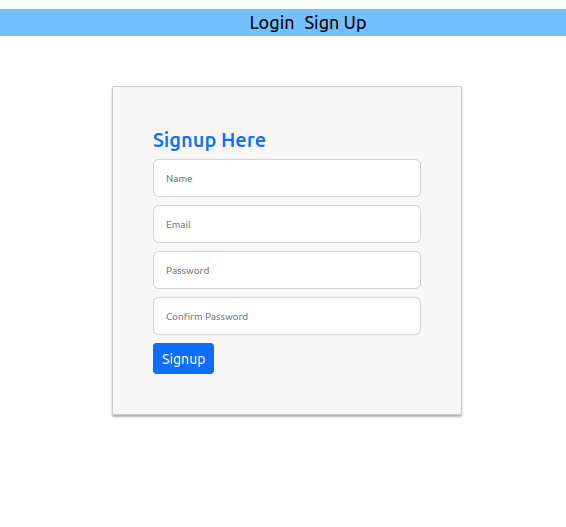
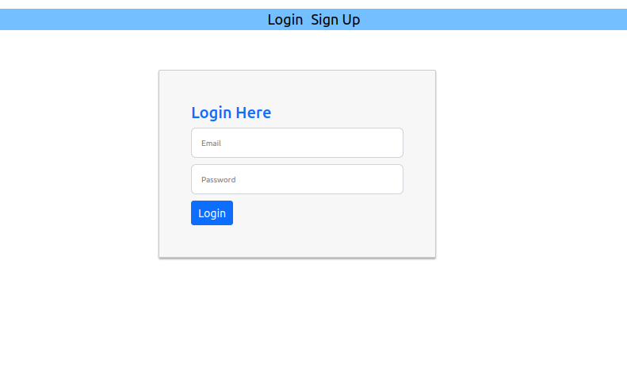
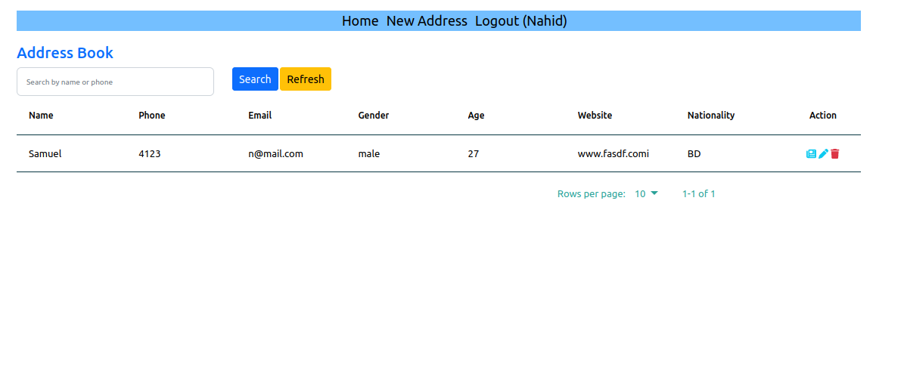
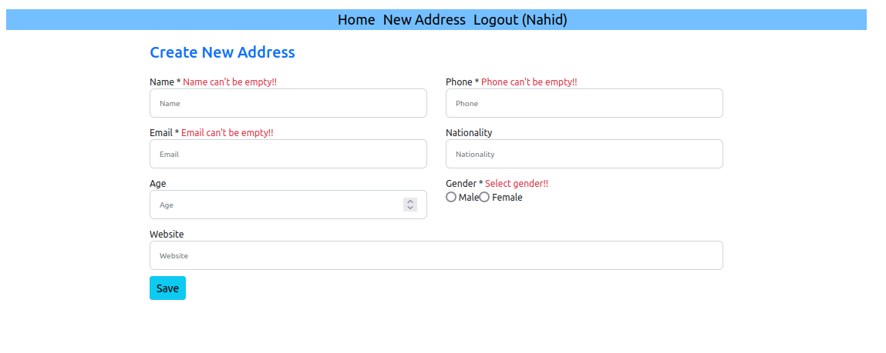
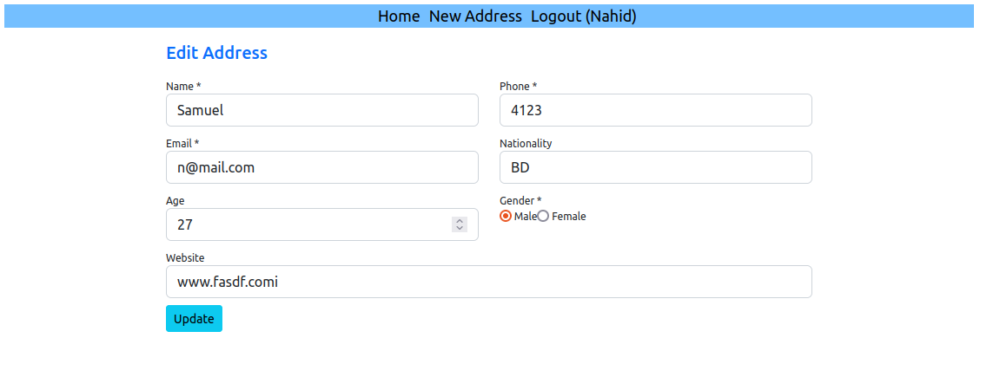
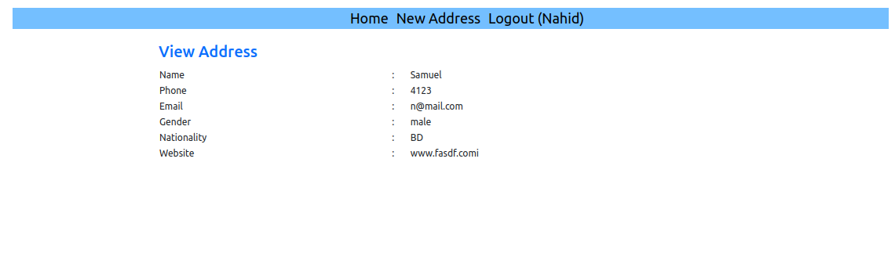

## Address Book with authentication system using react context API and reducer

## Instructions

- Clone the project.
- Enter -into the project directory.
- Run command 'sudo docker-compose build'
- After successfully build Run 'sudo docker-compose up'
- Go to browser and enter the url 'http://127.0.0.1:3009'

## Signup

## Login

## Address Book

  
## Add new address

  
  
## Edit address

  
## View page

